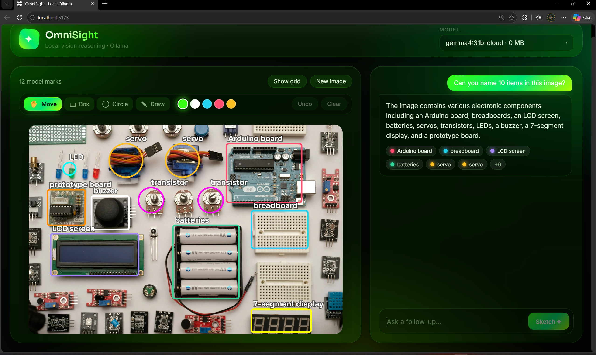
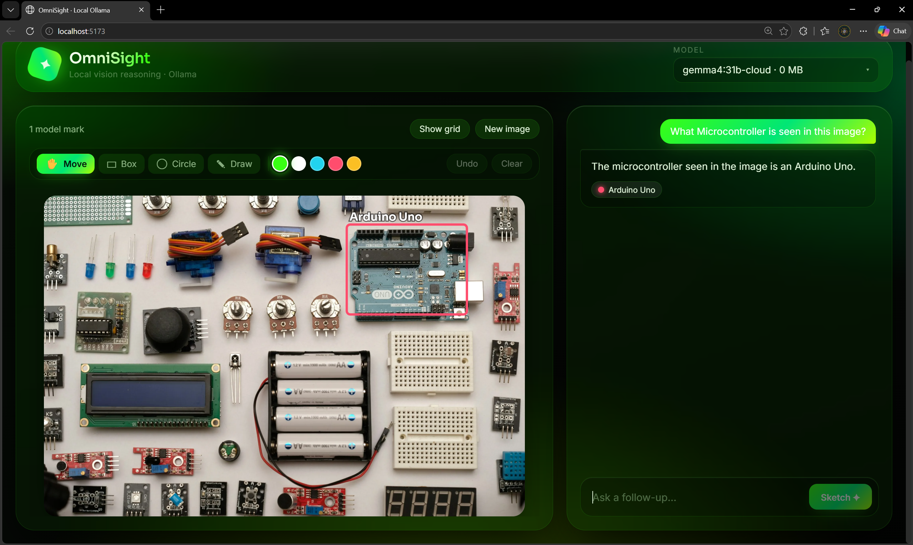
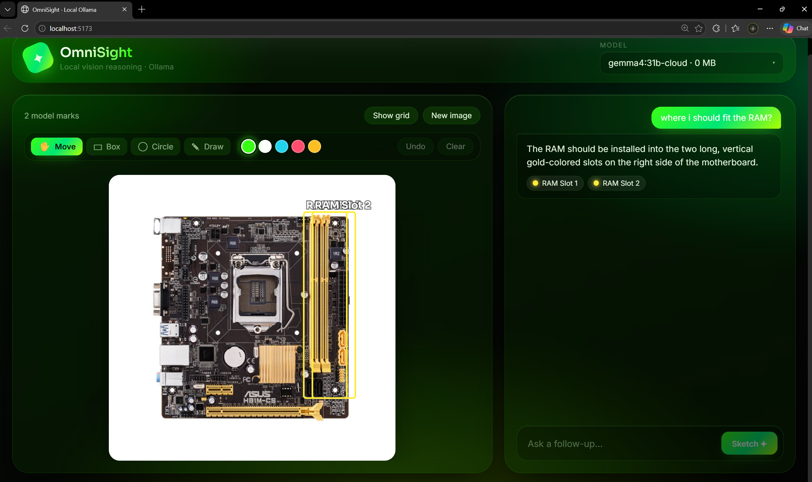
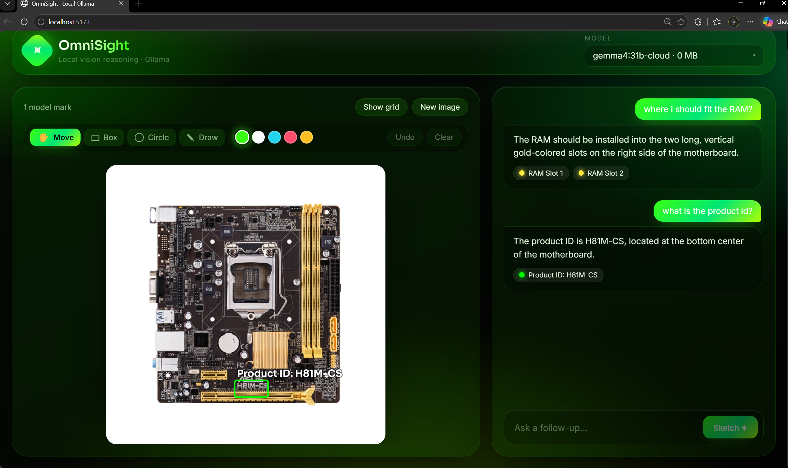

<div align="center">

# 🛰️ OmniSight

### Local vision-language reasoning that **draws on your images**

OmniSight is a privacy-first web app — inspired by [SketchVLM](https://sketchvlm.github.io/) —
that lets a local **[Ollama](https://ollama.com)** vision model answer questions about an
image by **sketching its reasoning directly on top of it**: circles, boxes, arrows and
labels rendered as a clean, non-destructive SVG overlay. You can draw your own marks too,
and the model sees them.

Everything runs on your machine. No API keys, no cloud, no images leaving your computer.


</div>

---

## 📸 Screenshots



> _OmniSight labelling 12 components on a real electronics board — Arduino, breadboards,
> LCD, servos, transistors, LEDs, a buzzer and a 7-segment display._

<table>
  <tr>
    <td width="50%">
      <br/>
      <sub><b>Precise localization</b> — “What microcontroller is this?” → boxes the Arduino Uno.</sub>
    </td>
    <td width="50%">
      <br/>
      <sub><b>Practical guidance</b> — “Where do I fit the RAM?” → marks both RAM slots.</sub>
    </td>
  </tr>
  <tr>
    <td width="50%">
      <br/>
      <sub><b>Multi-turn</b> — a follow-up locates the motherboard’s product ID.</sub>
    </td>
    <td width="50%" valign="top">
      <br/>
      <sub>A vibrant <b>uranium-green-on-black glassmorphism</b> UI: drag-and-drop upload,
      a model picker, a drawing toolbar, the annotated image canvas, and a multi-turn
      conversation panel.</sub>
    </td>
  </tr>
</table>

---

## ✨ Features

- 🎯 **Visual answers, not just text** — the model marks the exact regions it's reasoning
  about with circles, boxes, arrows, dots, lines and labels.
- ✍️ **Draw to point things out** — box, circle, or freehand tools let you highlight a
  region; your marks are flattened into the image so the model literally *sees* what you mean.
- 🔁 **Multi-turn refinement** — keep asking follow-ups; annotations accumulate per turn.
- 🧭 **Coordinate-grid grounding** — a 0–100 grid is overlaid before inference so the model
  places marks accurately (toggle it on/off in the UI).
- 🤖 **Auto model detection** — OmniSight queries Ollama and flags which of your installed
  models support vision.
- 🔒 **100% local** — talks only to your local Ollama; no external services or secrets.
- 🎨 **Distinct glassmorphism theme** — uranium-green accents on a near-black aurora
  background, responsive down to mobile.
- 🪟 **One-click launch on Windows** — `run.bat` sets everything up and starts both servers.

---

## 🧠 How it works

```
 ┌──────────┐   1. upload + question    ┌─────────────────────┐
 │ Frontend │ ────────────────────────► │  FastAPI backend    │
 │ (React)  │                           │                     │
 │          │   your drawings are       │  2. overlay 0–100   │
 │          │   burned into the image   │     coordinate grid │
 │          │                           │  3. call Ollama     │
 │          │ ◄──────────────────────── │     vision model    │
 └──────────┘   4. answer + JSON marks  └──────────┬──────────┘
       │                                            │
       │ 5. render marks as an SVG layer            ▼
       │    over the ORIGINAL image           ┌───────────┐
       └─────────────────────────────────────►│  Ollama   │
                                              └───────────┘
```

1. You upload an image and ask a question (optionally drawing on it first).
2. The backend overlays a **0–100 coordinate grid** for spatial grounding.
3. The gridded image + prompt go to your chosen **Ollama vision model**.
4. The model replies with a short answer **plus** a JSON block of annotation primitives.
5. The frontend renders those primitives as a crisp SVG overlay on the *original* image.

---

## 🛠️ Tech stack

| Layer       | Tools                                                        |
| ----------- | ------------------------------------------------------------ |
| Frontend    | React 18, Vite 6, plain CSS (design tokens + glassmorphism)  |
| Backend     | FastAPI, Uvicorn, Pillow (grid overlay), httpx               |
| Inference   | [Ollama](https://ollama.com) running any vision model locally |

---

## 📦 Requirements

- **[Ollama](https://ollama.com)** installed and running (`ollama serve`)
- At least one **vision-capable** model — detected automatically. Good options:
  ```bash
  ollama pull gemma3          # general-purpose vision (recommended)
  ollama pull llava           # classic, lightweight vision model
  ollama pull medgemma1.5:4b  # medical imagery
  ```
- **Python 3.10+** and **Node 18+**

---

## 🚀 Quick start

### Option A — Windows (easiest)

Double-click **`run.bat`**. On first run it creates the Python virtual environment,
installs all backend + frontend dependencies, launches both servers, and opens the app.
Make sure Ollama is running first.

### Option B — Manual (any OS)

**1. Backend**

```bash
cd backend
python -m venv venv

# Windows:
venv\Scripts\activate
# macOS / Linux:
source venv/bin/activate

pip install -r requirements.txt
uvicorn app:app --reload --port 8000
```

**2. Frontend** (in a new terminal)

```bash
cd frontend
npm install
npm run dev
```

Open **http://localhost:5173**. The Vite dev server proxies `/api` to the backend
(`localhost:8000`), which talks to Ollama at `localhost:11434`.

---

## 🎨 Using the app

1. **Upload** an image (drag-and-drop or click to browse).
2. **Pick a model** from the dropdown — vision-capable models are grouped at the top.
3. _(Optional)_ **Draw on the image** with the toolbar:
   - ✋ **Move** — default, no drawing
   - ▭ **Box** — drag a bounding box
   - ◯ **Circle** — click the center, drag out the radius
   - ✎ **Draw** — freehand scribble
   - Pick an ink color, or **Undo** / **Clear** your marks.
4. **Ask a question** and hit **Sketch ✦**. Your drawings (green dashed) are sent to the
   model, which replies with its own marks (solid) and a short answer.
5. **Toggle the grid** to see the coordinate overlay the model used.
6. Ask **follow-ups** to refine, or click **New image** to start over.

---

## 🗂️ Project structure

```
.
├── run.bat                     # One-click Windows launcher (setup + run)
├── backend/
│   ├── app.py                  # FastAPI routes: /api/models, /api/sketch
│   ├── ollama_client.py        # Ollama wrapper: list models, chat-with-image
│   ├── grid.py                 # Pillow 0–100 coordinate-grid overlay
│   ├── annotations.py          # System prompt + tolerant JSON/primitive parser
│   └── requirements.txt
└── frontend/
    ├── index.html
    ├── vite.config.js          # Dev server + /api proxy to backend
    └── src/
        ├── App.jsx             # Orchestration & state
        ├── api.js              # Backend fetch wrapper
        ├── lib/composite.js    # Flattens user drawings into the image
        ├── components/
        │   ├── UploadZone.jsx
        │   ├── ModelSelector.jsx
        │   ├── ImageStage.jsx      # Image + measured render box
        │   ├── AnnotationLayer.jsx  # SVG renderer (model + user marks)
        │   ├── DrawLayer.jsx        # Interactive drawing surface
        │   ├── DrawToolbar.jsx      # Tool + color picker
        │   ├── Conversation.jsx
        │   └── QuestionBar.jsx
        └── styles/             # Design tokens + glassmorphism theme
```

---

## ⚙️ Configuration

| What                | Where                                    | Default                  |
| ------------------- | ---------------------------------------- | ------------------------ |
| Ollama URL          | `backend/ollama_client.py` (`OLLAMA_BASE_URL`) | `http://localhost:11434` |
| Backend port        | `uvicorn ... --port` & `frontend/vite.config.js` proxy | `8000`             |
| Frontend port       | `frontend/vite.config.js`                | `5173`                   |
| Max upload size     | `backend/app.py` (`MAX_IMAGE_BYTES`)     | 12 MB                    |
| Request timeout     | `backend/ollama_client.py`               | 600 s                    |

---

## 🧩 API

| Method | Endpoint       | Description                                                      |
| ------ | -------------- | --------------------------------------------------------------- |
| `GET`  | `/api/health`  | Health check.                                                   |
| `GET`  | `/api/models`  | List installed Ollama models, flagging vision support.          |
| `POST` | `/api/sketch`  | Run one turn: `{ model, question, image (base64), history }` → `{ answer, annotations, gridded_image }`. |

---

## 🐛 Troubleshooting

| Problem                              | Fix                                                                 |
| ------------------------------------ | ------------------------------------------------------------------- |
| `Cannot reach Ollama`                | Start it: `ollama serve` (or open the Ollama app).                  |
| `run.bat` flashes and closes         | Run it from an open terminal to read the error; ensure Python is on PATH. |
| "No vision model found"              | Pull one: `ollama pull gemma3`, then refresh.                       |
| Port already in use (`8000`/`5173`)  | Close a previous session's windows, or change the port (see Configuration). |
| Marks are slightly off               | Use a larger vision model — coordinate accuracy scales with model size. |

---

## 📝 Notes & limitations

- Multi-turn passes the **text** history back each turn; the model's previous marks are
  not re-composited into the image (your own drawings are).
- Annotation accuracy depends heavily on the vision model. `gemma3` (or larger) is a solid baseline.
- All inference is local. If you pick a `:cloud`-tagged model, Ollama routes it to its
  hosted tier — that's the only case anything leaves your machine.

---

## 🙏 Acknowledgements

- Concept inspired by **[SketchVLM](https://sketchvlm.github.io/)**
  ([Brandon-Collins7/sketchvlm](https://github.com/Brandon-Collins7/sketchvlm)).
- Powered by **[Ollama](https://ollama.com)** for local model serving.

## 📄 License

[MIT](LICENSE) © Murali Kannan
